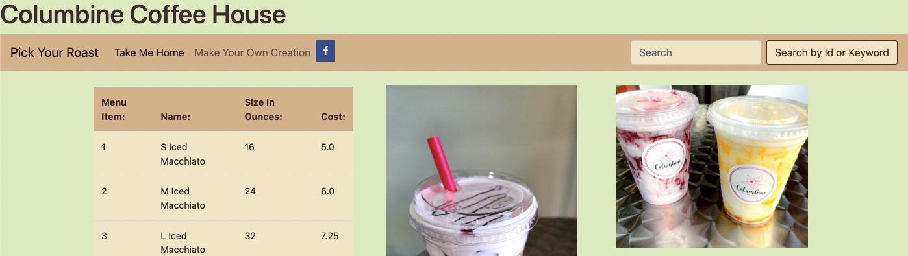

# JPACRUDProject

## About The Project
---
JPACRUDProject is a Dynamic Web Application that allows the user to perform CRUD operations on a MYSQL database of Coffee objects.

          1. Create: Provided by a "Make Your Own Creation" link and can be accessed via the homepage
          2. Read: Search function available with parameters of id or keyword
          3. Update: Update provided fields associated with an existing Coffee object
          4. Delete: Remove an existing object from the database

### Technologies Used:

          - Spring Tool Suite 4
          - MYSQL
          - MYSQL Workbench
          - GRADLE
          - MAMP
          - Apache Tomcat v8.5
          - HTML/CSS
          - Atom
          - JPA
          - JPQL
          - BootStrap v5.1

## Project Function
---

---

Upon initial access to the webpage, users are presented a homepage. The homepage host a "menu" which is a fill list of Coffee objects from the database. There is a NavBar built into every page within the program to allow for easy access to application functions. Users can access the "Make Your Own Creation", return to the homepage, use the search function, and access social media links.

Users can use the search function to search for Coffees that match their taste with a keyword, or access those already contained in the menu (database) with an id search. Users are able to delete or update Coffee objects by searching with id.

Via the "Make Your Own Creation" link, users can build their own coffee object with user input values. Their creation is store to the database, and can be accessed and operated on via the same operations mentioned above.

## Contact
---
### Cecelia Guerrero
- [LinkedIn](https://www.linkedin.com/in/cecelia-guerrero/)
- [Github](https://github.com/Cagugu)
- E-mail: guerrero.a.cecelia@gmail.com
